# Advance Data Mining and Machine Learning

- **Accademic year:** 2019/20
- **CdS:** Artificial Intelligence and Data Mining Engineering
- **Students:** Matilde Mazzini and Marsha Gรณmez Gรณmez
- **Project Name:** Games Genre Prediction

## Abstract

Websites like Rawg and Steam offer huges database of video games description to allow the users to browse and read about their favourite games.
They offer the possibility to browse these games info pages per genre, to help users selecting the game of interest based on the genre. The genre tagging process is complex and time consuming: games are assigned to one or more genres based on the proposals sent by the users and consumers. If we can automatize this process of game tagging, not only will it be fast, save human effort but it will be more accurate than an untrained human as well.

We collected data using one of many available API on internet. We relied on text analysis of the Plot/Summary of the video game data collected and trained our classifiers using text analysis techniques.


## Introduction

GIAR (Games information and Ratings) is an application that collects information and ratings about videogames. An admin can insert a new game in the GIAR database accessig the Insert New Game page. During this process the admin should specify many information about the game like: name, release date, description, genre and many more.

The idea of the project is to add a genre prediction feature to the existing GIAR application to make the process of inserting a new game faster. 
After the admin loads a description of a game on the insert a new game page, the application offers the possibility to predic the multiple genres to which a game belongs and proposes the result in a list that the admin can modify. 

## Multi-label or Multi-class?
Because of the fact that a game can be (and often so) associated with **more than one** genres, this is not a multi-class classification problem (when there’s only one label per observation), but this could be solved as a multi-label classification challenge (where multiple labels may be assigned to each instance).

#### Multi-class models
- Many class values c={c1,c2,...ck}
- An object may belong to only **one** class. Oj -> Cj

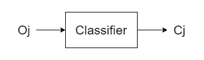

A standard k-fold cross validation may be used to evaluate this classifier, because one object may belong to only one class and the confusion matrix it is easy to construct.

#### Multi-label models
- Many class values c={c1,c2,...ck}
- An object may belong to **multiple** class. Oj -> (Cj,Cp,Cq)

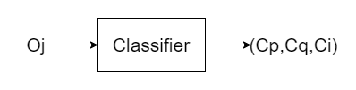

Most of the classifiers we studied work like multi-class classifiers: they assign one class to each object. We need to find a classifier that assign multiple class to a single object. 
This will be implemented like this:
- Creating a 2-class classifier per each class like binary classifiers do (recognize one class, discard others).
- Use such models in parallel.

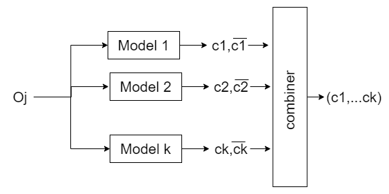

### Evaluation
Since an object may belong to multiple classes, to evaluate the correctness of the classification the overall result must be taken into consideration. a normal confusion matrix can't be build for such problem because it map the relation between predicted and real class of an object that belongs to a single class.
a special confusion matrix must be constructed.

## Data Collection 

The Data set was retrieved from Rawg, an online video games database. The documents of almost 80,000 games were scraped with the Rawg API. For this project **65,000** unique titles in which both the description and genre information were available were selected.

There are 19 listed genres in the data set and only the **12**  most commong genres were used in this project. The genres names and percentages of games in them are: 

Genre | Count | Percentage
------------ | ------------- | -------------
Action | 6848 | 22 %
Adventure | 4725 | 15 %
Puzzle | 4412 | 14 %
RPG | 3105 | 10 %
Simulation | 2745 | 9 %
Strategy | 2660 | 9 %
Shooter | 2101 | 7 %
Sports | 1122 | 4 %
Racing | 1000 | 3 %
Educational | 549 | 2 %
Fighting | 593 | 2 %
BoardGames | 640 | 3 %

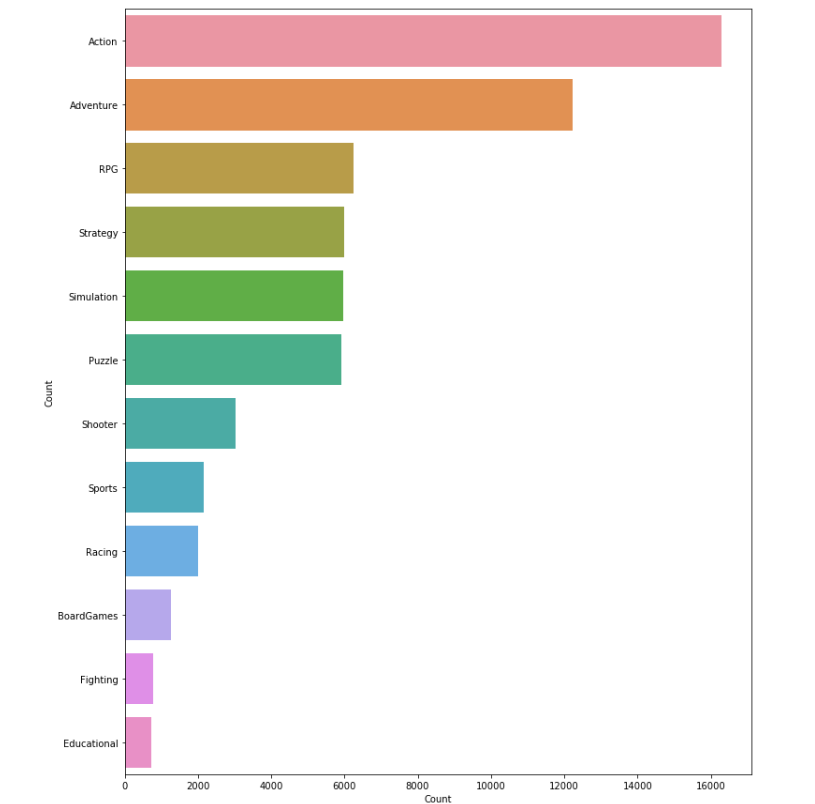

## Data Preprocessing

The very first data set cleaning step was to retrieve from the overall database only the description and the list of genres for every game. 

sono state rimossi i record in cui non era presente la lista dei genere e la descrizione

poi un'operazione di pulizia del testo dai link e dalle virgole è stata fatta per creare il csv. 

sono stati eliminati i record non in lingua inglese

sono state rimosse le parole 

i giochi con piu generi sono stati unwinded, ottenendo come risultato finale che un gioco appare piu volte ma ogni volta con un solo genere


dataset finale che è stato passato in java è stato bilanciato inserendo per ogni genere 400 items presi randomicamente dal dataset completo. stando attenti a non ripetere un gioco.

1: Description, 2: Genre:

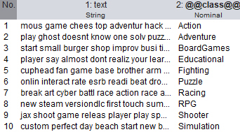


Balanced structure of the dataset:

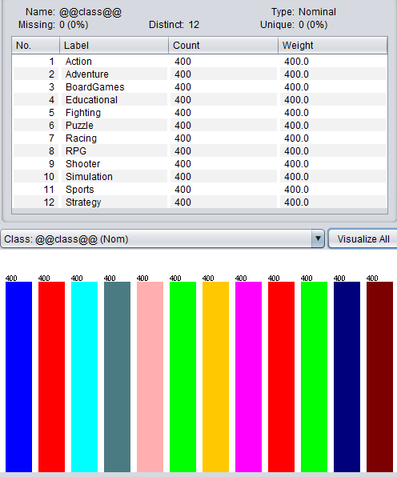

dim dataset 4800 istanze. 400 per ogni genere

## Java weka
il dataset viene randomizzato, shuffle of the items.

l'intero dataset viene diviso in 10 fold per la cross validation.

a ogni ciclo cambia il training e il test set

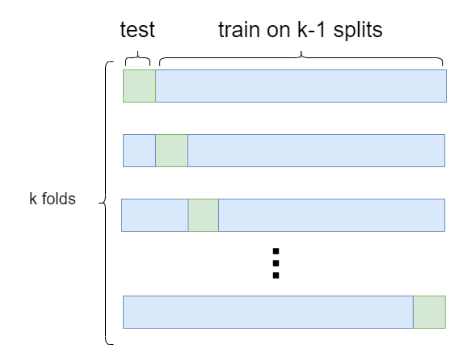

per ognuno di queste combinazioni di test e training:

a partire dal corrente training ser vengono creati 12 dataset binari uno per ogni genere
e con questi binari vengono addestrati 12 classificatori binari che vengono testati tutti con il test set corrente tolte le etichette
fold 0


training

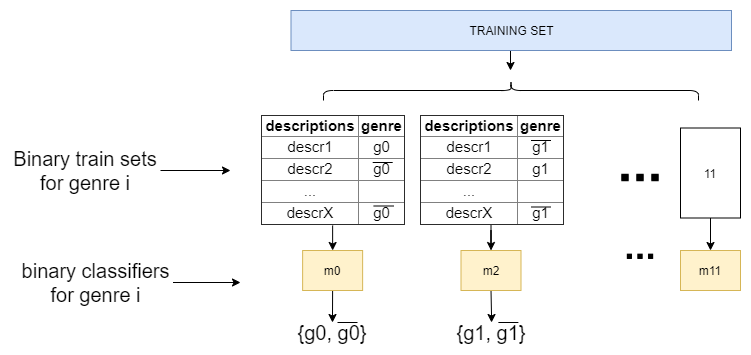

test evaluation
confusiona matrix build

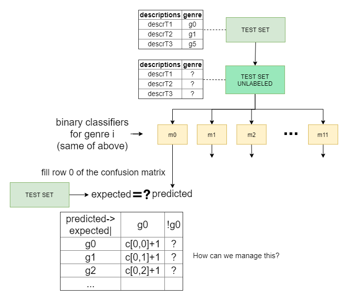
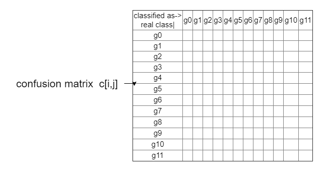


## Naive Bayes

## SMO

## Random Forest


### Interface

Admin interface:
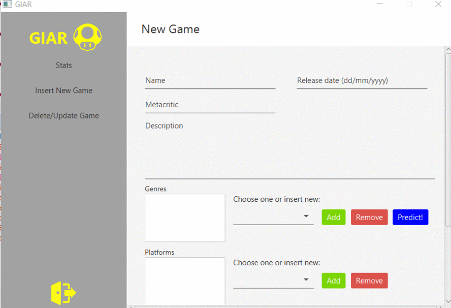


## Implementation

```java

	static Instances [][] vettTrain = new Instances [10][12];	// vector of binary datasets TRAIN ONE PER EACH FOLD
	static Instances [] vettTest = new Instances [10];	// vector of datasets TEST ONE PER EACH FOLD
	
	static NaiveBayesMultinomialText [] vettNaive = new NaiveBayesMultinomialText[12];

	static int[][] confusionMatrix = new int[12][12];
	

		List<String> genres = new ArrayList<>();
		genres.add("Puzzle");
		genres.add("Adventure");
		genres.add("Action");
		genres.add("RPG");
		genres.add("Simulation");
		genres.add("Strategy");
		genres.add("Shooter");
		genres.add("Sports");
		genres.add("Racing");
		genres.add("Educational");
		genres.add("Fighting");
		genres.add("BoardGames");
		
		
		//inizializza array di classificatori
		for(int z = 0; z < genres.size(); z++) {		
			String[] options;
			try {
				//naive
				options = weka.core.Utils.splitOptions("-W -P 0 -M 2.0 -norm 1.0 -lnorm 2.0 -lowercase -stopwords-handler weka.core.stopwords.Rainbow -tokenizer weka.core.tokenizers.AlphabeticTokenizer -stemmer \"weka.core.stemmers.SnowballStemmer -S porter\"");		
				vettNaive[z]= new NaiveBayesMultinomialText();
				vettNaive[z].setOptions(options);
				
				
			} catch (Exception e) {
				// TODO Auto-generated catch block
				e.printStackTrace();
			}
			
		}

		createDatasets(genres);


	
	public static void createDatasets( List<String> genres){

			// Reading Entire Dataset
			DataSource source;
			try {
				source = new DataSource("src/main/resources/dataset400.arff");
				Instances data = source.getDataSet();			
				data.setClassIndex(data.numAttributes()-1);
				
				// Randomize and stratify the dataset
				data.randomize(new Random(1)); 	 // randomize instance order before splitting dataset
				//data.stratify(10);	// 10 folds
				
				for(int i=0; i<10; i++){ // To calculate the results in each fold
					
					Instances test = data.testCV(10, i);
					Instances train = data.trainCV(10, i);
 
					// Make the last attribute be the class
					train.setClassIndex(train.numAttributes() - 1);
					test.setClassIndex(test.numAttributes() - 1);
					
					//TO CHECK
					vettTest[i]=test;
					
					//System.out.println(i + " train size" + train.size());	
					//System.out.println(i + " test size" + test.size());	
		
					int numInstancesTrain = train.size();
				
					
					System.out.println("fold: "+ i + " " +train.size() + ":train" + "test: " + test.size());
					
					//CREATION OF 12 BINARY DATATSETS (repeats this for every fold)
					createBinaryDatasets( genres, numInstancesTrain, train, i, test);				
				}	
					
			} catch (Exception e) {
				// TODO Auto-generated catch block
				e.printStackTrace();
			}
	}
	

	public static void createBinaryDatasets( List<String> genres,  int numInstances, Instances train, int foldnum, Instances test) {
		try {
			for(int z = 0; z < genres.size(); z++) {	//12 generi			
				ArrayList<Attribute> attributes = new ArrayList<Attribute>();
				ArrayList<String> labels = new ArrayList<String>();
				labels.add(genres.get(z));
				labels.add("other");

				attributes.add(new Attribute("description", true));
				attributes.add(new Attribute("genre", labels));

				Instances binTrainDataset = new Instances("Try", attributes, 800);
				binTrainDataset.setClassIndex(binTrainDataset.numAttributes() - 1);

				// adding instances		
				int class_count = 0;

				//insert the rows with genre!=other
				for ( int j = 0; j < numInstances; j++ ){	//per ogni riga del db				
					double[] val = new double[2];
					val[0] = binTrainDataset.attribute(0).addStringValue(train.instance(j).stringValue(0));	//val0 prende la descr

					if(train.instance(j).stringValue(train.numAttributes() - 1).equals(genres.get(z))) {
						val[1] = 0; 	//val1 prende 

						binTrainDataset.add(new DenseInstance(1.0, val));
						class_count++;
						
					}	
					
				}
				
				
				//insert the rows with genre=other
				for ( int j = 0; j < numInstances; j++ ){	//per ogni riga del db				
					double[] val = new double[2];
					val[0] = binTrainDataset.attribute(0).addStringValue(train.instance(j).stringValue(0));

					if(!train.instance(j).stringValue(train.numAttributes() - 1).equals(genres.get(z))) {
						if(class_count > 0) {
							val[1] = 1;
							binTrainDataset.add(new DenseInstance(1.0, val));
							class_count--;
						}
					}
					
					if(class_count == 0) {
						break;
					}			
				}
				
				/*
					//save in arff files to check on weka the results
					ArffSaver saver = new ArffSaver();
					saver.setInstances(binTrainDataset);
					try {
						saver.setFile(new File("src/main/resources/folds/fold" +foldnum +"/" + genres.get(z) + "_dataset.arff"));
						saver.writeBatch();
					} catch (IOException e) {
						// TODO Auto-generated catch block
						e.printStackTrace();
					}
				 */
				

				vettTrain[foldnum][z] = binTrainDataset;	//save the db in the dbarray at genre z position	

				// retrain the classifier for this binary
				
				//vettNaive[z].buildClassifier(binTrainDataset);
				//vettSMO[z].buildClassifier(binTrainDataset);
				//vettRandomForest[z].buildClassifier(binTrainDataset);
				
				//testNaive(test,z,genres);
				//testSMO(test,z,genres);
				//testRandomForest(test,z,genres);

				
				
				System.out.println("fold: "+ foldnum + " " +binTrainDataset.size() + ":bin" + "gener"+ genres.get(z));
			}
		} catch (Exception e) {
			// TODO Auto-generated catch block
			e.printStackTrace();

		}

	}
	

	public static void testNaive(Instances test, int z, List<String> genres ) {
		try {
			Instances unlabeled = new Instances (test);
			for (int i = 0; i < test.numInstances();i++){
				unlabeled.instance(i).setClassMissing(); 
			}

			System.out.println("Unlabeled:\n");
			System.out.println(unlabeled);				

			//Classifying unlabeled instances
			System.out.println("\nClassifying instances:\n");

			for (int i = 0; i < unlabeled.numInstances();i++){
				System.out.print("Instance ");
				System.out.print(i);


				String predicted;
				String expected;
				if(vettNaive[z].classifyInstance(unlabeled.instance(i)) == 0)
					predicted = genres.get(z);
				else
					predicted = "other";
				expected = genres.get((int)test.instance(i).classValue());

				System.out.print("\nEstimated Class: ");
				System.out.println(predicted);
				System.out.print("Actual Class: ");
				System.out.println(expected);

				if (predicted.equals(expected)) {
					confusionMatrix[z][z] = confusionMatrix[z][z] +1;
				} else if(!predicted.equals(expected) && !predicted.equals("other")) {
					confusionMatrix[z][(int)test.instance(i).classValue()] = confusionMatrix[z][(int)test.instance(i).classValue()] +1;
				}
			}	
		///printmatrix
	
		} catch (Exception e) {
			// TODO Auto-generated catch block
			e.printStackTrace();
		}
}


```
exporting the 12 models to be used in the genre prediction
```java
//export models
for(int z = 0; z < genres.size(); z++) {		
        SerializationHelper.write(new FileOutputStream("./src/main/resources/models/"+genres.get(z)+".model"), vettNaive[z]);	
}
```


### Genre Prediction

In the following code the description loaded by the admin is collected and used to build a dataset with only one instace with missing class.
The dataset is given as input to the 12 classifiers, everytime a classifier of a specific genre gives a positive output, that genre is added to the list of predicted genres that the admin can modify in case of unprecise prediction.

```java
	public static List<String> predictGenres(String descrizione) {
		List<String> predictedGenres = new ArrayList<String>();
		try {	
			//decription cleaning 	
			descrizione = descrizione.replaceAll("(https?http|ftp|file)://[-a-zA-Z0-9+&@#/%?=~_|!:,.;]*[-a-zA-Z0-9+&@#/%=~_|]", " ");
			descrizione = descrizione.replaceAll("\\s+", " ");

			//build dataset with just one istance
			ArrayList<Attribute> attributes = new ArrayList<Attribute>();
			ArrayList<String> labels = new ArrayList<String>();
			labels.add("other");

			attributes.add(new Attribute("description", true));
			attributes.add(new Attribute("genre", labels));

			Instances unlabeled = new Instances("Try", attributes, 1);	//1 num istances
			unlabeled.setClassIndex(unlabeled.numAttributes() - 1);
			// adding instances			
			double[] val = new double[2];
			val[0] = unlabeled.attribute(0).addStringValue(descrizione);
			val[1] = 0;
			
			unlabeled.add(new DenseInstance(1.0, val));
			unlabeled.instance(0).setClassMissing(); 

			//for every model predict
			for(int z = 0; z < genres.size(); z++) {
				NaiveBayesMultinomialText NBMT;

				NBMT = (NaiveBayesMultinomialText)SerializationHelper.read("./src/main/resources/models/"+ genres.get(z) + ".model");
				System.out.println();
				if(NBMT.classifyInstance(unlabeled.instance(0)) == 0) {
					String predgen = genres.get(z);
					predictedGenres.add(predgen);	        
				}	
			}

		} catch (Exception e) {
			e.printStackTrace();
		}

		return predictedGenres;
	}
```


